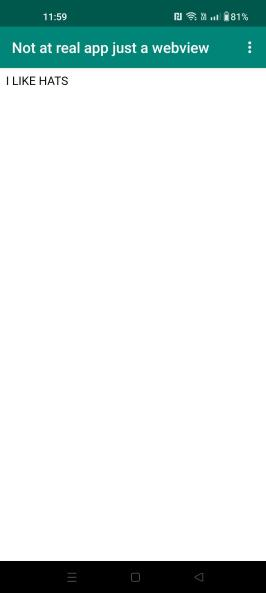

# Rapport

I denna uppgift har det ändrats i fyra filer.
Den första filen var string.xml 
Den andra är activity_main.xml
Detta för att sätta in själva webbViewn
Den tredje är MainActivity.java
Detta för att sätta in funktioner na av knapparna
Den sista var AndroidManifest.xml

```
        private WebView myWebView;
    public void showExternalWebPage(){
        // TODO: Add your code for showing external web page here


        myWebView.loadUrl("https://www.google.com/search?q=fedoras&sxsrf=APwXEddRIvIwxRTy5zI4uc9qAklGUEauAw:1680599212021&source=lnms&tbm=isch&sa=X&ved=2ahUKEwjd-ar474_-AhUOS_EDHfr5COMQ_AUoAXoECAEQAw&biw=1920&bih=969&dpr=1");


    }

    public void showInternalWebPage(){
        // TODO: Add your code for showing internal web page here


        myWebView.loadUrl("file:///android_asset/BACON.HTML");

    }
    protected void onCreate(Bundle savedInstanceState) {
        super.onCreate(savedInstanceState);
        setContentView(R.layout.activity_main);
        Toolbar toolbar = findViewById(R.id.toolbar);
        setSupportActionBar(toolbar);
        myWebView=findViewById(R.id.my_webview);
        myWebView.getSettings().setJavaScriptEnabled(true);
        myWebView.setWebViewClient(new WebViewClient());
    }
    
    
    @Override
    public boolean onCreateOptionsMenu(Menu menu) {
        // Inflate the menu; this adds items to the action bar if it is present.
        getMenuInflater().inflate(R.menu.menu_main, menu);
        return true;
    }

    @Override
    public boolean onOptionsItemSelected(MenuItem item) {
        // Handle action bar item clicks here. The action bar will
        // automatically handle clicks on the Home/Up button, so long
        // as you specify a parent activity in AndroidManifest.xml.
        int id = item.getItemId();

        //noinspection SimplifiableIfStatement
        if (id == R.id.action_external_web) {
            showExternalWebPage();
            Log.d("==>","Will display external web page");
            return true;
        }

        if (id == R.id.action_internal_web) {
            showInternalWebPage();
            Log.d("==>","Will display internal web page");
            return true;
        }

        return super.onOptionsItemSelected(item);
    }
```

Internal webpage


External webpage


